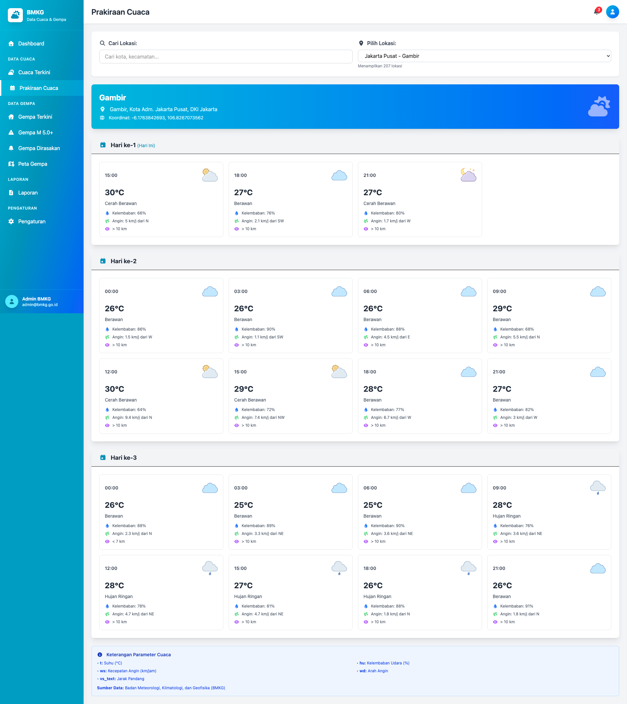

# 🌤️ Sistem Pelaporan Data BMKG

<p align="center">
  
  
  
  
</p>

Aplikasi web modern untuk memantau dan menampilkan data cuaca dan gempa bumi real-time dari **Badan Meteorologi, Klimatologi, dan Geofisika (BMKG)** Indonesia.

## ✨ Fitur Utama

### 📊 Dashboard Modern

-   **Welcome Banner** dengan jam real-time
-   **Stats Cards** dengan gradien warna dan animasi
-   **Gempa Terkini** dengan shakemap interaktif
-   **Quick Access Menu** untuk navigasi cepat
-   **Responsive Design** untuk semua perangkat

### 🌤️ Data Cuaca

-   **Cuaca Terkini** - Data real-time dari 5 kota besar
-   **Prakiraan Cuaca** - Prakiraan hingga beberapa hari ke depan
-   **200+ Lokasi** di seluruh Indonesia
-   **Fitur Pencarian** lokasi
-   **Data Lengkap**: Suhu, Kelembaban, Kecepatan Angin, Arah Angin, Jarak Pandang

### 🏚️ Data Gempa Bumi

-   **Gempa Terkini** dengan shakemap dan zona dampak
-   **Gempa M 5.0+** - Daftar gempa dengan magnitudo 5.0 atau lebih
-   **Gempa Dirasakan** - Gempa yang dirasakan masyarakat
-   **Peta Interaktif** dengan Leaflet.js
-   **Zona Intensitas MMI** (Modified Mercalli Intensity)
-   **Detail Modal** untuk setiap gempa

### 🗺️ Peta Interaktif

-   **Peta Sebaran Gempa** di seluruh Indonesia
-   **Zona Dampak Gempa** dengan 4 tingkat intensitas
-   **Marker Dinamis** berdasarkan magnitudo
-   **Filter Real-time** untuk jenis gempa
-   **Auto Refresh** setiap 5 menit

## 🚀 Teknologi

-   **Backend**: Laravel 11
-   **Frontend**: Tailwind CSS, Alpine.js
-   **Maps**: Leaflet.js
-   **Icons**: Font Awesome
-   **API**: BMKG Open Data API

## 📦 Instalasi

### Prasyarat

-   PHP >= 8.2
-   Composer
-   Node.js & NPM
-   MySQL/PostgreSQL (opsional)

### Langkah Instalasi

1. **Clone Repository**

```bash
git clone https://github.com/alfreinsco/bmkg.git
cd bmkg
```

2. **Install Dependencies**

```bash
composer install
npm install
```

3. **Setup Environment**

```bash
cp .env.example .env
php artisan key:generate
```

4. **Build Assets**

```bash
npm run build
# atau untuk development
npm run dev
```

5. **Jalankan Aplikasi**

```bash
php artisan serve
```

6. **Akses Aplikasi**

```
http://localhost:8000
```

## 📁 Struktur Aplikasi

```
bmkg/
├── app/
│   └── Http/
│       └── Controllers/
│           ├── DashboardController.php
│           ├── CuacaController.php
│           ├── GempaController.php
│           ├── LaporanController.php
│           └── PengaturanController.php
├── resources/
│   └── views/
│       ├── dashboard.blade.php
│       ├── cuaca/
│       │   ├── terkini.blade.php
│       │   └── prakiraan.blade.php
│       ├── gempa/
│       │   ├── terkini.blade.php
│       │   ├── m5.blade.php
│       │   ├── dirasakan.blade.php
│       │   └── peta.blade.php
│       └── components/
│           └── layouts/
│               └── app.blade.php
├── routes/
│   └── web.php
└── public/
    ├── fontawesome/
    └── leaflet/
```

## 🌐 API Endpoints BMKG

Aplikasi ini menggunakan API publik dari BMKG:

### Gempa Bumi

-   **Gempa Terkini**: `https://data.bmkg.go.id/DataMKG/TEWS/autogempa.json`
-   **Gempa M 5.0+**: `https://data.bmkg.go.id/DataMKG/TEWS/gempaterkini.json`
-   **Gempa Dirasakan**: `https://data.bmkg.go.id/DataMKG/TEWS/gempadirasakan.json`

### Cuaca

-   **Prakiraan Cuaca**: `https://api.bmkg.go.id/publik/prakiraan-cuaca?adm4={code}`

## 🎨 Fitur UI/UX

### Desain Modern

-   **Gradien Warna** cyan-blue untuk tema utama
-   **Animasi Smooth** pada hover dan transisi
-   **Card Design** dengan shadow dan rounded corners
-   **Responsive Grid** untuk berbagai ukuran layar

### Interaktivitas

-   **Hover Effects** pada semua elemen interaktif
-   **Modal Popup** untuk detail gempa
-   **Real-time Clock** di dashboard
-   **Auto Refresh** data gempa
-   **Search & Filter** lokasi cuaca

### Peta Leaflet

-   **Zoom Disabled** untuk fokus pada data
-   **Pan/Drag Enabled** untuk eksplorasi
-   **Circle Markers** dengan warna berdasarkan magnitudo
-   **Popup Info** detail saat klik marker
-   **Auto Fit Bounds** untuk menampilkan semua zona

## 📊 Zona Intensitas Gempa (MMI)

Aplikasi menghitung zona dampak gempa berdasarkan formula seismologi:

-   **Zona Sangat Kuat (MMI VII-IX)** - Merah: Kerusakan serius
-   **Zona Kuat (MMI V-VI)** - Orange: Kerusakan ringan
-   **Zona Sedang (MMI III-IV)** - Kuning: Getaran jelas
-   **Zona Lemah (MMI I-II)** - Hijau: Getaran ringan

Formula: `R = 10^(0.5 × M - 1.5)` dengan faktor kedalaman

## 🗺️ Lokasi Cuaca Tersedia

### Jawa

-   DKI Jakarta (40 kecamatan)
-   Jawa Barat (Bandung, Bekasi, Depok, Cimahi, dll)
-   Jawa Tengah (Semarang, Solo, Salatiga, dll)
-   DI Yogyakarta (14 kecamatan)
-   Jawa Timur (Surabaya, Malang, dll)

### Sumatera

-   Sumatera Utara (Medan, Pematangsiantar, Binjai)
-   Sumatera Barat (Padang, Bukittinggi)
-   Riau (Pekanbaru, Dumai)
-   Lampung (Bandar Lampung, Metro)

### Kalimantan

-   Kalimantan Barat (Pontianak, Singkawang)
-   Kalimantan Selatan (Banjarmasin, Banjarbaru)
-   Kalimantan Timur (Balikpapan, Samarinda, Bontang)

### Sulawesi

-   Sulawesi Utara (Manado, Bitung, Tomohon)
-   Sulawesi Selatan (Makassar, Palopo, Parepare)

### Bali & Nusa Tenggara

-   Bali (Denpasar)
-   NTB (Mataram, Bima)
-   NTT (Kupang)

### Maluku & Papua

-   Maluku (Ambon, Tual)
-   Maluku Utara (Ternate, Tidore)
-   Papua (Jayapura)

**Total: 200+ Lokasi**

## 🔧 Konfigurasi

### Timeout API

Ubah timeout di `app/Http/Controllers/CuacaController.php`:

```php
$response = Http::timeout(10)->get($url);
```

### Auto Refresh Interval

Ubah interval di `resources/views/gempa/peta.blade.php`:

```javascript
setInterval(loadEarthquakeData, 5 * 60 * 1000); // 5 menit
```

## 📝 Lisensi & Attribution

### Lisensi Aplikasi

MIT License - Bebas digunakan untuk keperluan edukasi dan pengembangan

### Attribution BMKG

**PENTING**: Wajib mencantumkan BMKG sebagai sumber data:

> Data bersumber dari **Badan Meteorologi, Klimatologi, dan Geofisika (BMKG)** Indonesia

Aplikasi ini sudah mencantumkan attribution di:

-   Footer setiap halaman cuaca
-   Info box di dashboard
-   Keterangan di halaman prakiraan

## 🤝 Kontribusi

Kontribusi sangat diterima! Silakan:

1. Fork repository
2. Buat branch fitur (`git checkout -b feature/AmazingFeature`)
3. Commit perubahan (`git commit -m 'Add some AmazingFeature'`)
4. Push ke branch (`git push origin feature/AmazingFeature`)
5. Buat Pull Request

## 📧 Kontak & Support

Untuk pertanyaan, saran, atau laporan bug:

-   **Email**: alfreinsco@gmail.com
-   **Issues**: [GitHub Issues](https://github.com/alfreinsco/bmkg/issues)

## 🙏 Acknowledgments

-   **BMKG** - Untuk menyediakan API data terbuka
-   **Laravel** - Framework PHP yang powerful
-   **Tailwind CSS** - Utility-first CSS framework
-   **Leaflet.js** - Library peta interaktif open-source
-   **Font Awesome** - Icon library

## 📸 Screenshots

### Dashboard


### Peta Gempa


### Prakiraan Cuaca



---

<p align="center">
  Made with ❤️ for Indonesia
  <br>
  <strong>Badan Meteorologi, Klimatologi, dan Geofisika (BMKG)</strong>
</p>
